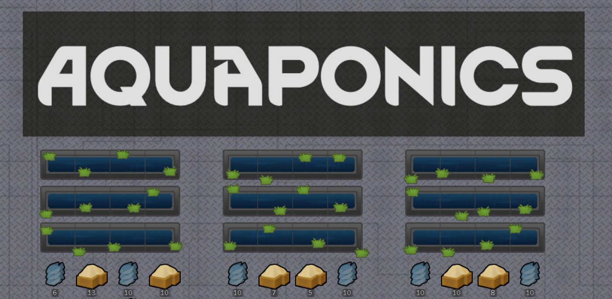

  
   
  
    Made by <a href="https://github.com/Aevear">Aevear</a>
  

 

Provides an alternative production table to Hydroponics, Aquaponics!

---

This mod is an alternate of the [Hydroponics Basin][hydroponics-basin] for [RimWorld][rimworld] that has reduced plant output but can also produce fish slowly overtime.

## Features

- Aquaponics table

This table produces any normal hydroponics crop with a reduction in yield (about 50%) with an output of fish that should make the difference. 

It requires 10 fish to be added to the basin as "breeding stock" before it can produce fish. The tempeature range must also be between 10C and 42C for fish to breed. 

Fish options:
- Tilapia
- Carp
- Catfish

## Compatibility

Shouldn't have issue with anything as it doesn't interact with any other systems.

## Recipes

- [Aquaponics]
    - 100 steel, 2 component
    - 2,800 work, Construction 4
    - 1x4 Bay, 4 plants, 280% fertility
